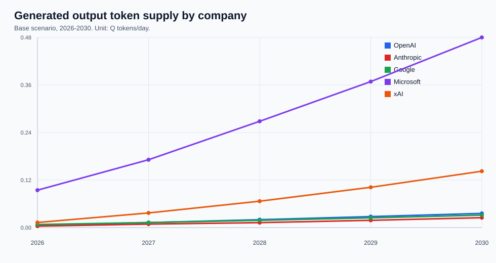
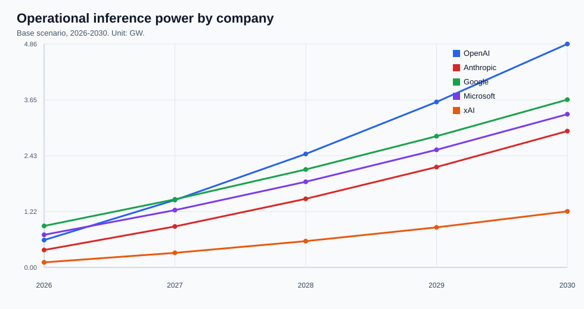
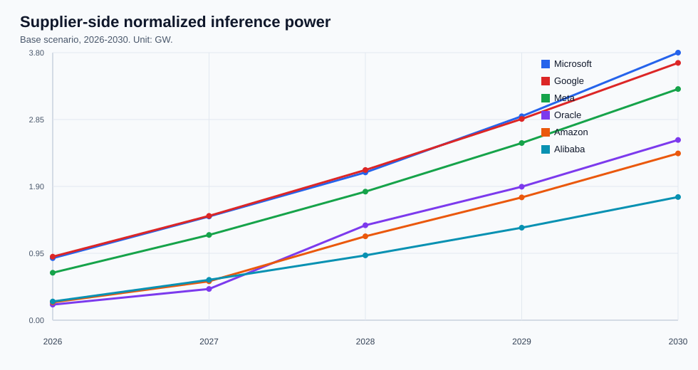
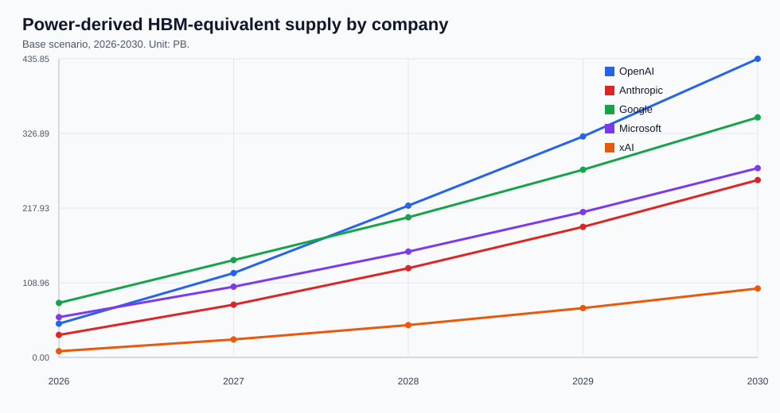

# 전력 기반 LLM 토큰 처리량 및 HBM 공급량 분석 리포트

_작성일: 2026-08-04. 범위: 주요 상용 LLM 사업자, 2026-2030년 Base/Bear/Bull 시나리오. 상세 테이블은 대시보드/CSV 산출물로 분리._

## Executive Summary

AI datacenter 전력은 더 이상 단순한 capacity headline으로만 해석하기 어렵다. 본 모델의 Base case에서 covered LLM owner들의 active AI power는 2026년 9.6 GW에서 2030년 42.1 GW로 확대된다. 그러나 토큰 공급량을 결정하는 것은 gross GW가 아니라 DCiE를 거친 IT power, training/inference split, CSP별 계약 비중, accelerator mix, 그리고 workload별 TPS/MW다.

2030년 Base case의 generated-output token supply는 1.22Q tokens/day다. 동시에 inference power는 23.0 GW, training/reserve power는 7.3 GW로 계산된다. 이 구조는 2026년 buildout 초기에는 training과 reserve가 크게 남아 있지만, 2029-2030년으로 갈수록 inference allocation이 빠르게 커지는 형태다.

HBM 관점에서는 2030년 power-derived HBM-equivalent demand가 2,035.0 PB, 24GB stack-equivalent 기준 84.79 million개에 이른다. 이 값은 token volume에서 직접 역산한 것이 아니라, normalized accelerator power를 all-in kW/unit과 HBM GB/unit으로 환산한 결과다. 따라서 HBM 공급량 논의에서는 토큰 수요보다 accelerator procurement mix가 더 직접적인 driver다.

## 분석 프레임워크

본 리포트는 세 개의 층으로 전력 기반 토큰 공급량을 산출한다. 첫째, datacenter와 CSP 계약 전력을 AI company별 가용 inference power로 정규화한다. 둘째, 각 CSP가 보유하거나 build할 accelerator mix를 적용해 H200, B200, GB200, TPU, Trainium 등으로 전력을 분해한다. 셋째, InferenceX public benchmark를 short, long, agentic workload proxy로 나누어 TPS/MW를 부여하고 commercial workload fit factor를 적용한다.

```text
Output tokens/day = inference GW * 1,000 * serving TPS/MW * 86,400
HBM-equivalent PB = accelerator MW * 1,000 / all-in kW per unit * HBM GB per unit / 1,000,000
```

Weighted DCiE는 2030년 83.3% 수준으로 계산된다. DCiE는 `1/PUE`이므로 facility power를 IT-deliverable power로 바꾸는 변환 계수다. 이는 accelerator utilization이 아니며, 실제 serving 효율은 latency SLO, prefill/decode scheduling, cache hit rate, concurrency, model routing에 의해 다시 조정된다.

## 2026-2030년 전력과 토큰 공급량의 변화

Base case에서 contracted power envelope는 2026년 25.0 GW에서 2030년 54.8 GW로 확대된다. Active power는 같은 기간 9.6 GW에서 42.1 GW로 증가한다. 더 중요한 변화는 inference share다. Inference power는 3.9 GW에서 23.0 GW로 커지고, weighted inference share는 55.9%에서 75.9%로 상승한다.

토큰 공급량은 2026년 0.200Q/day에서 2030년 1.219Q/day로 증가한다. 이 증가율은 단순 power ramp보다 크다. 전력이 증가하는 동시에 B200/GB200급 accelerator 비중이 높아지고, 일부 사업자는 commercial serving mix가 더 높은 TPS/MW proxy로 이동하기 때문이다.





## 공급자 관점: Epoch AI capacity를 CSP side로 다시 읽기

기존 user 관점은 OpenAI, Anthropic, Google, Microsoft, xAI 같은 LLM owner가 확보한 전력과 token supply를 보여준다. 반대로 공급자 관점은 같은 전력을 Microsoft, Oracle, Amazon, Google, CoreWeave, SpaceXAI 같은 CSP/datacenter provider가 어떤 AI user에게 공급하는지 보여준다. 이 관점은 HBM과 accelerator procurement를 추정할 때 특히 중요하다. HBM 수요는 최종 user의 token volume보다 공급자 fleet의 accelerator mix에 더 직접적으로 연결되기 때문이다.

Epoch 기반 supplier scope만 보면, normalized supplier inference power는 2026년 3.63 GW에서 2030년 21.06 GW로 증가한다. 2030년 supplier-side total AI power seed는 28.96 GW이고, AI-company contract power 합계는 27.04 GW다. 여기에는 Epoch attribution이 충분하지 않아 legacy company envelope로 보완된 row는 제외했다.



### Microsoft

Microsoft의 공급자 관점 power는 user별 LLM owner power를 다시 CSP side로 돌려 본 값이다. 2026년 normalized supplier inference power는 0.88 GW였고, 2030년에는 3.80 GW로 증가한다. 2030년 CSP total AI power seed는 4.08 GW, AI-company contract power 합계는 3.96 GW다.

2030년 normalized inference exposure는 Microsoft 79.5% / OpenAI 20.5% 순이다. Accelerator mix는 H200/A100/H100 5.8%, B200/B300 94.2%, GB200/GB300 0.0%, purpose-built/custom/future 0.0%로 계산된다. HBM-equivalent demand는 2030년 314.57 PB로 추정된다. 이 값은 해당 공급자의 capacity가 어느 AI user로 흘러가는지와 그 공급자의 accelerator mix가 무엇인지에 의해 결정된다.

### Google

Google의 공급자 관점 power는 user별 LLM owner power를 다시 CSP side로 돌려 본 값이다. 2026년 normalized supplier inference power는 0.90 GW였고, 2030년에는 3.65 GW로 증가한다. 2030년 CSP total AI power seed는 5.79 GW, AI-company contract power 합계는 4.59 GW다.

2030년 normalized inference exposure는 Google 100.0% 순이다. Accelerator mix는 H200/A100/H100 0.0%, B200/B300 8.9%, GB200/GB300 0.0%, purpose-built/custom/future 91.1%로 계산된다. HBM-equivalent demand는 2030년 350.25 PB로 추정된다. 이 값은 해당 공급자의 capacity가 어느 AI user로 흘러가는지와 그 공급자의 accelerator mix가 무엇인지에 의해 결정된다.

### Meta

Meta의 공급자 관점 power는 user별 LLM owner power를 다시 CSP side로 돌려 본 값이다. 2026년 normalized supplier inference power는 0.67 GW였고, 2030년에는 3.28 GW로 증가한다. 2030년 CSP total AI power seed는 4.32 GW, AI-company contract power 합계는 4.32 GW다.

2030년 normalized inference exposure는 Meta 100.0% 순이다. Accelerator mix는 H200/A100/H100 7.5%, B200/B300 73.8%, GB200/GB300 0.0%, purpose-built/custom/future 18.7%로 계산된다. HBM-equivalent demand는 2030년 302.26 PB로 추정된다. 이 값은 해당 공급자의 capacity가 어느 AI user로 흘러가는지와 그 공급자의 accelerator mix가 무엇인지에 의해 결정된다.

### Oracle

Oracle의 공급자 관점 power는 user별 LLM owner power를 다시 CSP side로 돌려 본 값이다. 2026년 normalized supplier inference power는 0.22 GW였고, 2030년에는 2.56 GW로 증가한다. 2030년 CSP total AI power seed는 5.78 GW, AI-company contract power 합계는 5.71 GW다.

2030년 normalized inference exposure는 OpenAI 100.0% 순이다. Accelerator mix는 H200/A100/H100 2.9%, B200/B300 72.3%, GB200/GB300 0.0%, purpose-built/custom/future 24.8%로 계산된다. HBM-equivalent demand는 2030년 243.65 PB로 추정된다. 이 값은 해당 공급자의 capacity가 어느 AI user로 흘러가는지와 그 공급자의 accelerator mix가 무엇인지에 의해 결정된다.

### Amazon

Amazon의 공급자 관점 power는 user별 LLM owner power를 다시 CSP side로 돌려 본 값이다. 2026년 normalized supplier inference power는 0.25 GW였고, 2030년에는 2.37 GW로 증가한다. 2030년 CSP total AI power seed는 3.45 GW, AI-company contract power 합계는 3.45 GW다.

2030년 normalized inference exposure는 Anthropic 100.0% 순이다. Accelerator mix는 H200/A100/H100 4.3%, B200/B300 1.7%, GB200/GB300 0.0%, purpose-built/custom/future 94.0%로 계산된다. HBM-equivalent demand는 2030년 208.46 PB로 추정된다. 이 값은 해당 공급자의 capacity가 어느 AI user로 흘러가는지와 그 공급자의 accelerator mix가 무엇인지에 의해 결정된다.

## 기업별 분석

### OpenAI: 멀티 CSP 기반의 frontier serving capacity

OpenAI는 본 모델에서 가장 넓은 외부 계약 전력 구조를 가진 사업자로 처리한다. Microsoft, Oracle, CoreWeave, G42, SoftBank 계열의 capacity path가 OpenAI의 inference pool로 정규화되어 들어오며, 핵심은 OpenAI의 토큰 공급량이 특정 CSP 한 곳의 전력이나 GPU mix로 설명되지 않는다는 점이다. 따라서 OpenAI의 결과값은 각 CSP의 계약 전력 비중과 해당 CSP의 accelerator mix가 결합된 가중 평균으로 읽어야 한다.

Capacity ramp는 2026년 active power 1.40 GW에서 2028년 4.95 GW, 2030년 8.50 GW로 이어진다. 같은 기간 inference power는 0.59 GW에서 4.86 GW로 증가한다. 이 변화는 단순한 설비 증설만이 아니라 training 중심 buildout에서 serving 중심 운영으로 이동하는 효과를 함께 반영한다.

Token supply는 2026년 0.0057Q/day에서 2030년 0.0362Q/day로 증가한다. HBM-equivalent demand는 같은 기간 49.28 PB에서 435.85 PB로 늘어난다. 2030년 inference power 기준 accelerator mix는 H200/A100/H100 3.7%, B200/B300 78.9%, GB200/GB300 4.3%, purpose-built/custom/future 13.1%로 모델링된다. 2030년 CSP-normalized inference power는 Oracle 52.6% / Microsoft 16.0% / CoreWeave 14.3% 순으로 크다.

TPS/MW는 의도적으로 보수적으로 잡았다. 작은 open model의 최대 benchmark가 아니라 frontier급 모델 라우팅을 proxy로 사용하기 때문이다. 따라서 OpenAI의 토큰 공급량은 proxy model 교체, B200/GB200 전환 속도, 그리고 실제 production traffic 중 더 작은 routed model이 차지하는 비중에 매우 민감하다.

### Anthropic: Amazon/custom accelerator 노출과 agentic-heavy mix

Anthropic은 일반 짧은 대화보다 long-context 및 agentic workload 비중이 높은 사업자로 모델링했다. Claude 사용처가 코딩, 리서치, 도구 사용 세션에 구조적으로 많이 노출되어 있기 때문이다. 따라서 단순 GW보다 capacity attribution이 중요하다. 특히 Trainium 비중이 높은 CSP mix에서는 NVIDIA GPU만으로 읽는 경우와 HBM 및 TPS/MW 결과가 크게 달라질 수 있다.

Capacity ramp는 2026년 active power 1.00 GW에서 2028년 3.25 GW, 2030년 5.50 GW로 이어진다. 같은 기간 inference power는 0.38 GW에서 2.97 GW로 증가한다. 이 변화는 단순한 설비 증설만이 아니라 training 중심 buildout에서 serving 중심 운영으로 이동하는 효과를 함께 반영한다.

Token supply는 2026년 0.0037Q/day에서 2030년 0.0252Q/day로 증가한다. HBM-equivalent demand는 같은 기간 32.75 PB에서 258.82 PB로 늘어난다. 2030년 inference power 기준 accelerator mix는 H200/A100/H100 7.9%, B200/B300 12.1%, GB200/GB300 0.0%, purpose-built/custom/future 80.1%로 모델링된다. 2030년 CSP-normalized inference power는 Amazon 79.8% / SpaceXAI 15.2% / Fluidstack 5.0% 순으로 크다.

Trainium과 같은 custom accelerator의 HBM 및 TPS/MW는 현재 낮은 신뢰도의 placeholder다. 비교 가능한 Trainium serving telemetry 또는 Claude production throughput이 확보되면 가장 먼저 교체해야 한다.

### Google: TPU-first internal fleet economics

Google은 TPU-first 내부 fleet으로 읽는 것이 적절하다. Gemini와 Google Cloud serving은 내부 최적화된 TPU infrastructure를 활용할 수 있으므로, 순수 NVIDIA benchmark와 동일하게 취급하지 않았다. 이 때문에 본 보고서에서는 Google의 purpose-built accelerator 노출이 높고, public GPU-only benchmark와의 비교 가능성은 상대적으로 낮다.

Capacity ramp는 2026년 active power 2.20 GW에서 2028년 4.50 GW, 2030년 6.80 GW로 이어진다. 같은 기간 inference power는 0.90 GW에서 3.65 GW로 증가한다. 이 변화는 단순한 설비 증설만이 아니라 training 중심 buildout에서 serving 중심 운영으로 이동하는 효과를 함께 반영한다.

Token supply는 2026년 0.0078Q/day에서 2030년 0.0318Q/day로 증가한다. HBM-equivalent demand는 같은 기간 79.52 PB에서 350.25 PB로 늘어난다. 2030년 inference power 기준 accelerator mix는 H200/A100/H100 0.0%, B200/B300 8.9%, GB200/GB300 0.0%, purpose-built/custom/future 91.1%로 모델링된다. 2030년 CSP-normalized inference power는 Google 100.0% 순으로 크다.

핵심 대체 데이터는 TPU 세대별 HBM, all-in power, Gemini serving TPS/MW다. 이 값이 들어오기 전까지 Google의 토큰 추정치는 방향성 판단에는 유용하지만 NVIDIA 기반 row보다 감사 가능성은 낮다.

### Microsoft: OpenAI attribution 이후의 Copilot/Azure AI serving burden

Microsoft는 OpenAI 모델 소유자 capacity를 분리한 뒤, 자체 Copilot 및 Azure AI serving surface로 모델링했다. 현재 dataset에서는 routed assistant workload에 가까운 proxy와 B200-heavy accelerator mix가 결합되어 높은 token-supply contribution이 나온다.

Capacity ramp는 2026년 active power 1.80 GW에서 2028년 4.00 GW, 2030년 6.20 GW로 이어진다. 같은 기간 inference power는 0.71 GW에서 3.33 GW로 증가한다. 이 변화는 단순한 설비 증설만이 아니라 training 중심 buildout에서 serving 중심 운영으로 이동하는 효과를 함께 반영한다.

Token supply는 2026년 0.0952Q/day에서 2030년 0.4840Q/day로 증가한다. HBM-equivalent demand는 같은 기간 58.72 PB에서 276.22 PB로 늘어난다. 2030년 inference power 기준 accelerator mix는 H200/A100/H100 5.2%, B200/B300 94.8%, GB200/GB300 0.0%, purpose-built/custom/future 0.0%로 모델링된다. 2030년 CSP-normalized inference power는 Microsoft 90.5% / Nscale 9.5% 순으로 크다.

가장 큰 모델링 리스크는 Microsoft platform power와 OpenAI model-owner power의 중복 계산이다. 따라서 CSP contract allocation sheet가 Microsoft와 OpenAI를 분리하는 핵심 control point다.

### xAI: 집중형 GPU buildout과 높은 serving leverage

xAI는 상대적으로 집중된 NVIDIA GPU fleet으로 모델링했다. TPU/Trainium처럼 custom accelerator 가정이 많이 개입되는 경우보다 계약 전력에서 accelerator unit과 HBM으로 이어지는 계산 경로가 더 투명하다. 현재 파일에서는 광범위한 CSP diversification보다는 active power ramp와 inference share 상승이 xAI의 token supply를 주로 움직인다.

Capacity ramp는 2026년 active power 0.35 GW에서 2028년 1.43 GW, 2030년 2.50 GW로 이어진다. 같은 기간 inference power는 0.11 GW에서 1.22 GW로 증가한다. 이 변화는 단순한 설비 증설만이 아니라 training 중심 buildout에서 serving 중심 운영으로 이동하는 효과를 함께 반영한다.

Token supply는 2026년 0.0129Q/day에서 2030년 0.1435Q/day로 증가한다. HBM-equivalent demand는 같은 기간 9.08 PB에서 100.60 PB로 늘어난다. 2030년 inference power 기준 accelerator mix는 H200/A100/H100 29.4%, B200/B300 70.6%, GB200/GB300 0.0%, purpose-built/custom/future 0.0%로 모델링된다. 2030년 CSP-normalized inference power는 SpaceXAI 100.0% 순으로 크다.

초기 ramp 구간에서는 training demand가 inference capacity를 밀어낼 수 있다. Grok traffic 또는 enterprise/API demand가 training cluster 재배치보다 빠르게 증가한다면, inference share가 가장 먼저 재검토해야 할 sensitivity다.

## Benchmark Proxy와 해석상 주의점

InferenceX는 production telemetry가 아니라 public serving benchmark proxy다. 따라서 본 모델은 benchmark를 그대로 매출 또는 실제 production token으로 보지 않는다. Short conversation, long conversation, agentic workload를 분리하고, 각 company별 traffic 성격에 따라 workload share와 commercial fit factor를 적용한다.

특히 agentic workload는 현재 공개 benchmark data가 상대적으로 부족하다. 본 모델에서는 long-context 및 dynamic reasoning proxy를 사용하되, direct evidence가 적은 영역이라는 점을 명시적으로 낮은 confidence로 남긴다. 향후 agentic traces가 더 축적되면 short/long/agentic 간 TPS/MW 비율은 가장 먼저 업데이트해야 하는 입력이다.

## HBM 공급량 관점의 시사점

HBM-equivalent demand는 2026년 327.0 PB에서 2030년 2,035.0 PB로 증가한다. 이 값은 token volume의 함수라기보다 accelerator unit 수의 함수에 가깝다. 따라서 HBM 공급량을 추정할 때는 AI company의 토큰 처리량만 보는 것보다, CSP별 accelerator mix와 세대별 all-in power, HBM GB/unit을 함께 보는 것이 더 정확하다.



## 결론

전력 기반 token capacity 모델은 AI datacenter headline을 LLM 공급량으로 번역하는 중간 언어다. 계약 전력은 시작점이지만, 실제 token supply는 CSP 계약 attribution, DCiE, inference share, accelerator mix, serving benchmark proxy가 결합될 때 비로소 해석 가능하다. 본 리포트의 목적은 특정 2030년 숫자를 고정된 예측치로 제시하는 것이 아니라, 각 입력값이 토큰 공급량과 HBM 수요를 어떤 방향으로 움직이는지 설명하는 것이다.

## 데이터 산출물

- 전체 시장 시계열 CSV: `llm_power_token_hbm_research_report_2026_2030_base_market_timeseries.csv`
- 5개 focus company 시계열 CSV: `llm_power_token_hbm_research_report_2026_2030_focus_company_timeseries.csv`
- 공급자/CSP 관점 전력 시계열 CSV: `llm_power_token_hbm_research_report_2026_2030_supplier_power_timeseries.csv`
- 공급자별 AI user exposure CSV: `llm_power_token_hbm_research_report_2026_2030_supplier_customer_exposure_2030.csv`
- CSP 계약 정규화 시계열 CSV: `llm_power_token_hbm_research_report_2026_2030_focus_csp_contract_timeseries.csv`
- 회사/연도별 HBM CSV: `llm_power_token_hbm_research_report_2026_2030_hbm_company_year.csv`
- 세부 accelerator power/HBM CSV: `llm_power_token_hbm_research_report_2026_2030_hbm_detail.csv`

## Sources And Caveats

- Epoch AI data centers: CSP/user capacity attribution, current/contracted IT power and completion timing seed. https://epoch.ai/data/ai-data-centers
- InferenceX benchmark dump: Public output-token TPS/MW benchmark proxy by model, GPU, ISL/OSL, concurrency and serving stack. https://inferencex.com/
- NVIDIA H200: H200 141GB HBM3e memory and hardware generation reference. https://www.nvidia.com/en-gb/data-center/h200/
- NVIDIA DGX B200: B200 system memory reference used for B200-class HBM proxy. https://docs.nvidia.com/dgx/dgxb200-user-guide/introduction-to-dgxb200.html
- NVIDIA GB200 NVL72: GB200 rack-scale Blackwell HBM reference. https://www.nvidia.com/en-us/data-center/gb200-nvl72/

- 이 결과는 scenario model이며 각 회사의 disclosed production telemetry가 아니다.
- Custom accelerator의 HBM 및 TPS/MW는 generation-specific disclosure가 확보되기 전까지 placeholder다.
- InferenceX public benchmark는 비교 가능한 proxy로 사용했으며, real serving은 SLO, concurrency, cache, routing, prefill/decode scheduling에 따라 달라질 수 있다.
